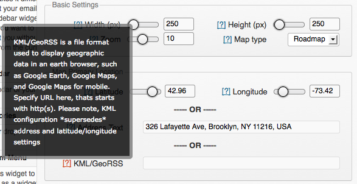
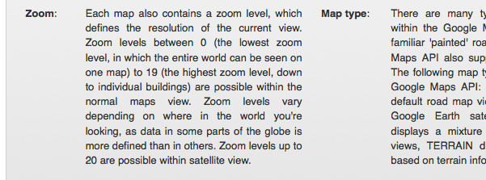
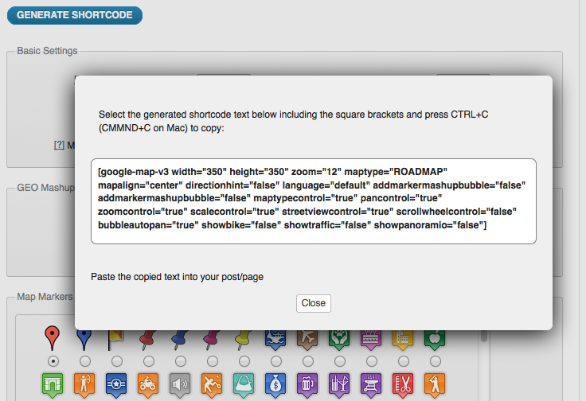
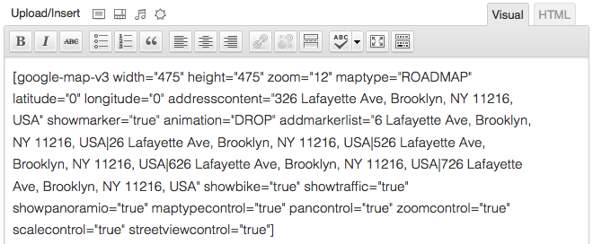
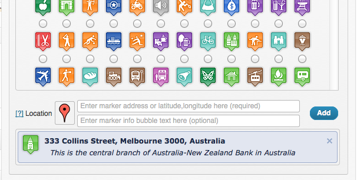
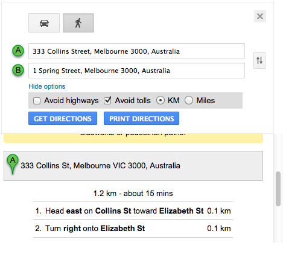
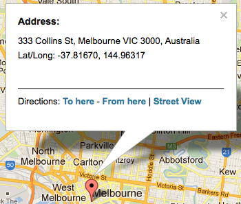
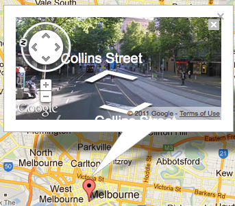
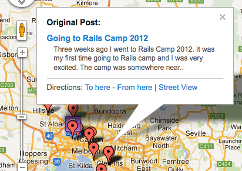

# Slick Google Map

  

Embed Google Maps (with your own API key) or OpenStreetMap/Leaflet maps via shortcode or Gutenberg block.

## Description

A simple, intuitive Google Map / OpenStreetMap plugin that installs as a Gutenberg block and a shortcode. Packed with useful features — geo-mashup of posts, KML overlays, marker icons, address geocoding — and fully free and open source. No subscriptions, no SaaS, no telemetry.

**Slick Google Map lets you embed maps using either:**

* **Google Maps** — requires your own API key (configurable per-site).
* **Leaflet / OpenStreetMap** — no key required, free tile service.

**Features:**

* Insert maps via the **Slick Google Map** Gutenberg block (with a multi-marker repeater) or the `[slick_map]` shortcode.
* Classic Editor users get a **Slick Map** media button above the editor that opens a dialog with the same repeater.
* **Marker geo-mashup** — aggregate every post/page that has `lat`/`lng` custom fields onto a single map.
* **KML and GPX overlays** — drop a track or boundary onto any map. KML works on both providers; GPX is Leaflet-only.
* **Address geocoding** — write `address="Vienna, Austria"` instead of coordinates. Geocoded once per address and cached for 30 days. Uses your Google Geocoding API key if set, falls back to Nominatim/OSM otherwise.
* **Coordinate formats** — accepts decimal (`48.2082`) and DMS (`48°12'29.5"N`) in any marker.
* **Marker icons** — bundled set of 13 modern SVG pins (default, restaurant, lodging, cafe, bar, museum, airport, rail, shop, camera, mountain, castle, religious), plus your own URL. Legacy filenames from the 2014-era plugin are auto-aliased.
* **Map controls** — toggle the zoom / map-type / street-view / scroll-wheel / drag controls per map.
* **Layers** — Google bicycling and traffic overlays on demand.
* **45° aerial tilt** — passed through to Google as `tilt: 45`. Only takes visible effect on vector Map IDs, or on satellite/hybrid view over the specific cities where Google has 45° aerial imagery. No effect on raster maps or on Leaflet.
* **Custom Google styles JSON** — for branded maps without cloud-styled Map IDs.
* **Wiki-style links** in marker titles: `[[https://example.com|Display text]]` becomes a real link.
* **Compatible with WordPress page caches** — no per-visitor state in the rendered HTML, no AJAX side-effects.
* **No fixed-cost dependencies** — Leaflet / OSM is free; Google Maps is pay-as-you-go with a generous monthly free tier (≈28k map loads/month at no charge).

**History:**

Slick Google Map 1.0 is a rewrite of the original plugin version 0.3, which was itself a fork of the *Comprehensive Google Map Plugin* by Alexander Zagniotov (2011–2014). Version 1.0.0 is a complete rewrite for WordPress 6.4+ and PHP 8.1+ — see the "Parity & rewrite" section below for what changed.

Insert a map via the **Slick Google Map** Gutenberg block, the **Slick Map** media button in the Classic Editor, or the `[slick_map]` shortcode. Optionally aggregate posts/pages that have `lat`/`lng` custom fields onto a single map ("geo-mashup"), and overlay a KML or GPX file.

### Shortcode

`[slick_map lat="48.2082" lng="16.3738" zoom="13" height="400px" provider="leaflet"]`

Geo-mashup of posts and pages:

`[slick_map mashup="post,page"]`

KML or GPX overlay:

`[slick_map kml="https://example.com/track.kml"]`
`[slick_map provider="leaflet" gpx="https://example.com/hike.gpx"]`

KML works with both providers; GPX requires the Leaflet provider (Google's Maps JS API does not natively render GPX).

Markers with addresses and custom icons (nested `[marker]` children):

`[slick_map zoom="6"]`
`[marker address="Vienna, Austria" title="Home"]`
`[marker lat="52.5" lng="13.4" title="Berlin" icon="https://example.com/star.png"]`
`[/slick_map]`

Each `[marker]` accepts `address` (geocoded once and cached) **or** explicit `lat`/`lng`, plus optional `title` and `icon`.

The `icon` attribute accepts either an `https://…` URL pointing to your own image, or one of the bundled short names: `default`, `restaurant`, `lodging`, `cafe`, `bar`, `museum`, `airport`, `rail`, `shop`, `camera`, `mountain`, `castle`, `religious`. Legacy filenames from the 2014-era plugin (`1-default.png`, `museum_naval.png`, `hotel_0star.png`, …) are auto-aliased to the nearest modern equivalent.

For geo-mashup markers, set a `marker_icon` custom field on each post to override the default pin for just that post.

### Map controls and layers

Toggle Google's built-in UI: `zoomcontrol`, `maptypecontrol`, `streetviewcontrol`, `scrollwheel`, `draggable` (all default `true`).

Google-only overlays: `showbike="true"`, `showtraffic="true"`.

45° aerial tilt: `tilt="45"`. Only takes visible effect on a Google vector Map ID, or in satellite/hybrid view over cities where Google has 45° imagery. Ignored elsewhere.

Custom Google map styles JSON: `styles='[{"featureType":"poi","stylers":[{"visibility":"off"}]}]'` (ignored when a Map ID is configured — cloud styling takes precedence).

### DMS coordinates

Marker `lat` / `lng` values accept either decimal (`48.2082`) or DMS form (`48°12'29.5"N`).

### Wiki-style links

Marker titles support `[[https://example.com|Display text]]` to embed real links, or `[[Plain Page]]` for unlinked highlighted text.

### Geocoding

When a Google Maps API key is configured the plugin uses the Google Geocoding API (same Cloud project as Maps; enable **Geocoding API** alongside Maps JavaScript). Otherwise it falls back to Nominatim/OpenStreetMap. Results are cached in a 30-day transient per address, so each unique address is geocoded at most once.

### Privacy

Using the Google provider loads scripts and tiles from `maps.googleapis.com`. Using the Leaflet/OSM provider loads tiles from `tile.openstreetmap.org` and the Leaflet library from `unpkg.com`. Choose the provider that matches your site's privacy posture.

## Installation

1. Upload the plugin to `/wp-content/plugins/slick-google-map/`.
2. Activate via **Plugins**.
3. Go to **Settings → Slick Google Map** to choose a provider and, if using Google, paste your API key.
4. **Strongly recommended when using the Google provider:** also create a *Map ID* in the Google Cloud Console (Google Maps Platform → Map Management → Create Map ID → type: JavaScript) and paste it into **Google Map ID**. Without a Map ID the plugin must fall back to the deprecated `google.maps.Marker`, which logs a console warning on every page load. With a Map ID set, modern `AdvancedMarkerElement` is used and the warning disappears.

## Parity & rewrite

Version 1.0.0 is a complete rewrite of the 2015 codebase. The old plugin's PHP and JavaScript were written against WordPress 3.6 and PHP 5, used the long-retired Google JSAPI loader, geocoded addresses on every page view, shipped 300+ marker PNGs of mixed provenance, and had several unauthenticated AJAX write paths in `wp-admin`. Re-issuing it as-is on a modern stack was not viable, so the codebase was rewritten from scratch around the same shortcode vocabulary.

**What you keep.** Posts written against the very old `[google-map-v3 ...]` shortcode still render. The plugin registers `google-map-v3` as a back-compatibility alias that maps the still-useful attributes (`width`, `height`, `zoom`, `kml`, `maptype`, `addmarkermashup`, `addmarkerlist`, `maptypecontrol`, `zoomcontrol`, `streetviewcontrol`, `scrollwheel`, `draggable`, `showbike`, `showtraffic`, `tiltfourtyfive`, `styles`) onto the new renderer. The Google provider is selected by default for these legacy shortcodes, the old `addmarkerlist="addr{}icon{}desc|..."` packed format is parsed transparently, and the most-used legacy icon filenames (`1-default.png`, `museum_naval.png`, `hotel_0star.png`, …) are aliased to the bundled modern SVG set.

**What's gone for good.** Some features can't come back because the upstream services or APIs disappeared:

* `panoramio` — Google shut Panoramio down in November 2016.
* `pancontrol` — Google removed `panControl` from the Maps API in 2017; there is no flag to set anymore.
* `google.maps.KmlLayer` — deprecated April 2026; replaced internally with a `fetch` + KML→GeoJSON renderer.
* The old `https://www.google.com/jsapi` loader — retired by Google in 2017; the modern loader requires a user-supplied API key.

**What's not yet back.** Marker clustering, directions/routing, geolocation marker, and marker drop/bounce animations are reachable from the rewrite but not yet wired up. See [PARITY.md](https://github.com/norbusan/slick-google-map-plugin/blob/master/PARITY.md) on GitHub for the full, categorised list (restored / new / missing-but-doable / deprecated-by-upstream / deliberately-dropped) plus a migration cheat-sheet.

**What was dropped on purpose.** The sidebar widget (Classic Widgets is in long-term legacy mode), the saved-shortcodes admin library (it was the largest single security surface in the old plugin), and the 300+ marker PNG library (replaced with 13 modern SVGs plus a legacy-filename alias map) — see `PARITY.md` for the rationale on each.

## Frequently Asked Questions

### How do I get a Google Maps API key?

Sign in to the Google Cloud Console (`https://console.cloud.google.com/`), create a project, enable **Maps JavaScript API** (and optionally **Geocoding API**), then **Credentials → Create credentials → API key**. Restrict the key to your site by HTTP referrer. Paste it into **Settings → Slick Google Map → Google Maps API key**. The Maps Platform gives you a ~\$200/month free credit, which is roughly 28,000 dynamic map loads — enough for most personal sites at no cost.

### Do I really need an API key?

Only if you want to use Google Maps. The plugin ships a Leaflet/OpenStreetMap provider that requires no key, no account, and no billing. Pick it in **Settings → Slick Google Map → Default provider**, or per-map with `provider="leaflet"`.

### Why does Settings → Slick Google Map nag me to add a Map ID?

Without a Map ID, the plugin falls back to `google.maps.Marker`, which Google deprecated in February 2024 and logs a console warning for. Creating a Map ID (Google Cloud Console → Google Maps Platform → Map Management → Create Map ID → JavaScript) and pasting it into the plugin settings lets the plugin use the modern `AdvancedMarkerElement` and the warning disappears.

### What's the correct way to define coordinates?

The safest option is plain decimal (`43.6387194`, `-116.2413513`). The plugin also accepts DMS forms:

* `43°38'19.39"N, 116°14'28.86"W`
* `43 38 19.39, -116 14 28.86`
* `43.6387, -116.2413` (semicolon also works as separator)

If you provide an `address="…"` attribute instead, the plugin geocodes it once and caches the result.

### Will my old `[google-map-v3 ...]` posts still work?

Yes. The legacy shortcode is registered as a back-compat alias. The most-used attributes pass through to the modern renderer; obsolete ones are silently ignored. See `PARITY.md` on GitHub for the per-attribute mapping.

### Is the plugin compatible with WordPress caching plugins?

Yes. The rendered HTML is fully static (a `<div>` with a `data-sgmp` JSON payload). Map and tile loading happens in the visitor's browser. WP Super Cache, W3 Total Cache, LiteSpeed Cache, and similar all work without configuration.

### Where are the screenshots / saved shortcodes / TinyMCE button from the old plugin?

The saved-shortcodes admin and the TinyMCE Quicktag are gone (replaced by the Gutenberg block and, for Classic Editor users, a media button above the editor). The sidebar widget is also gone — use the block. See "Parity & rewrite" above and `PARITY.md` for the full list of dropped features and the reasoning.

## Contributors

### Current maintainer
* Norbert Preining

### Original author of the upstream "Comprehensive Google Map Plugin" (2011–2014)
* Alexander Zagniotov — thanks for the original work, released under GPL.

### Additional contributors
* Honza Rameš

## Upgrade Notice

### 1.0.0
Complete rewrite for WordPress 6.4+ / PHP 8.1+. Old `[google-map-v3 ...]` posts keep rendering via a back-compat alias; the sidebar widget and saved-shortcodes admin are gone. See the "Parity & rewrite" section of the description and `PARITY.md` on GitHub for the full migration notes.

## Screenshots


*Map output on a published post*


*Settings page — provider, API key, defaults*


*Geo-mashup of posts/pages with lat/lng meta*


*Gutenberg block in the editor*


*Classic Editor "Slick Map" media button + dialog*


*KML overlay on the Google provider*


*KML overlay on the Leaflet/OSM provider*


*Marker popup with linked post title*


*Shortcode usage example*

## Changelog

### 1.0.0
* Complete rewrite for WordPress 6.4+ / PHP 8.1+. Old codebase replaced by a small PSR-4-style `src/` tree with declared types and `ABSPATH` guards.
* New Gutenberg block (`sgmp/map`) with multi-marker repeater; legacy TinyMCE button removed; Classic Editor gets a "Slick Map" media button with the same repeater.
* Google Maps now requires a user-supplied API key (Settings page). New Leaflet/OpenStreetMap provider as a key-free alternative, switchable per-map.
* Modern Google Maps loader (inline bootstrap + `importLibrary`); `AdvancedMarkerElement` used automatically when a Map ID is configured.
* Server-side address geocoding (Google when key set, Nominatim/OSM fallback) with 30-day per-address transient cache.
* KML overlays now rendered via `fetch` + inline KML→GeoJSON parser → `google.maps.Data`, replacing the deprecated `KmlLayer`.
* GPX overlays on the Leaflet provider.
* 13 bundled SVG marker icons; ~50 historical PNG filenames aliased to the modern set; per-marker `icon="…"` accepts URLs or short names.
* Wiki-style links and DMS coordinate parsing.
* Map control toggles (`zoomcontrol`, `maptypecontrol`, `streetviewcontrol`, `scrollwheel`, `draggable`), Google bicycle/traffic layers, tilt, and custom Google map styles JSON.
* HTTPS upgrade for `http://` overlay URLs on SSL pages — fixes mixed-content blocks on historical posts.
* All form/AJAX entry points dropped or protected with nonces + capability checks. All DB queries use `$wpdb->prepare()`; all output is escaped.
* Removed legacy JSAPI loader (`google.com/jsapi`) which Google retired in 2017.
* PHPUnit test suite (56 tests, 145 assertions) and a GitHub Actions CI workflow that runs the tests on PHP 8.1 / 8.3 and enforces `README.md` ↔ `readme.txt` sync.

### 0.3 (2015)
* Fix support for parsing (nearly) arbitrary coordinate formats.

### 0.2 (2015)
* Allow editing of saved shortcodes.

### 0.1 (2015)
* Initial fork: rebranding the 9.1.2 release of the *Comprehensive Google Map Plugin*, removing MMpro export code and renaming the widget.

## Development

```bash
composer install   # install dev dependencies
composer test      # run the PHPUnit suite
composer readme    # regenerate this README.md from readme.txt
```

Source layout under `src/`:

- `Plugin.php` – entry point, wires sub-modules
- `Options.php` – settings DTO with `sanitize()` as the trust boundary
- `Admin/Settings.php` – Settings API page
- `Admin/ClassicEditor.php` – "Slick Map" media button + dialog
- `Frontend/Shortcode.php` – `[slick_map]` renderer
- `Frontend/LegacyShortcode.php` – `[google-map-v3]` back-compat alias
- `Frontend/Assets.php` – script/style registration, Google bootstrap
- `Geo/PostQuery.php` – geo-mashup query (prepared SQL, transient-cached)
- `Block/Block.php` – server-rendered Gutenberg block

_This file is generated from `readme.txt`. Edit that file, then run `composer readme`._
